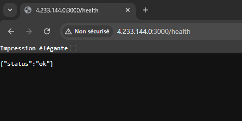

# TP — CI/CD Pipeline

---

##  Fonctionnement du pipeline
À chaque push sur `main`, **GitHub Actions** exécute automatiquement les étapes suivantes :

1. **Tests unitaires** avec **Jest**
2. **Tests End-to-End (E2E)** avec **Cypress**
3. **Build de l’image Docker**
4. **Push de l’image sur Docker Hub**
5. **Déploiement sur la VM Azure via SSH**
   - Pull de la nouvelle image Docker
   - Arrêt de l’ancien conteneur
   - Redémarrage du conteneur `myapp`
6. **Healthcheck automatique** via l’endpoint `/health`

 **Le pipeline s’arrête immédiatement si un test échoue**, garantissant que seule une version stable est déployée.

---

##  Déclenchement du déploiement
Le déploiement est **100 % automatique**.

 **Action requise :**
- Faire un `git push` sur la branche `main`

Aucune intervention manuelle n’est nécessaire.

---

## Choix techniques

- **Docker**
  - Déploiement reproductible
  - Application exposée sur le **port 3000**

- **GitHub Actions**
  - Jobs séparés avec dépendances (`needs:`)
  - Séparation claire des responsabilités (tests, build, déploiement)

- **GitHub Secrets**
  - Identifiants Docker Hub
  - Clé SSH pour la VM Azure

- **Azure VM**
  - Déploiement via SSH
  - Conteneur unique pour garantir l’**idempotence**

---

## Healthcheck
Une fois le déploiement terminé, l’application expose un endpoint de vérification :

```
http://<IP_PUBLIQUE_VM>:3000/health
```

Réponse attendue :
```json
{ "status": "ok" }
```

Ce healthcheck permet de valider automatiquement que l’application est bien opérationnelle après le déploiement.

---


